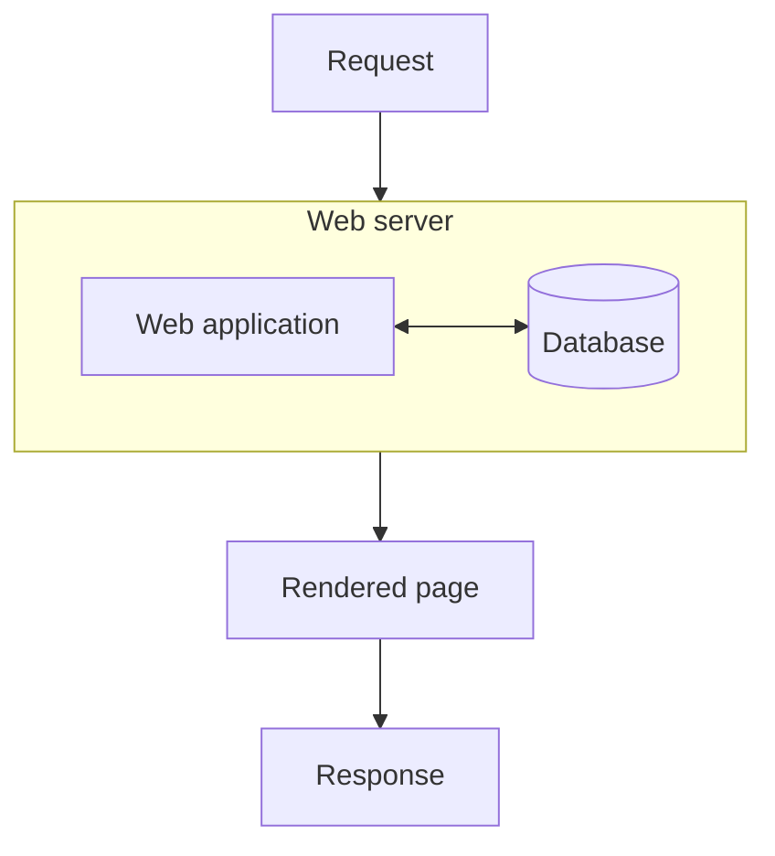
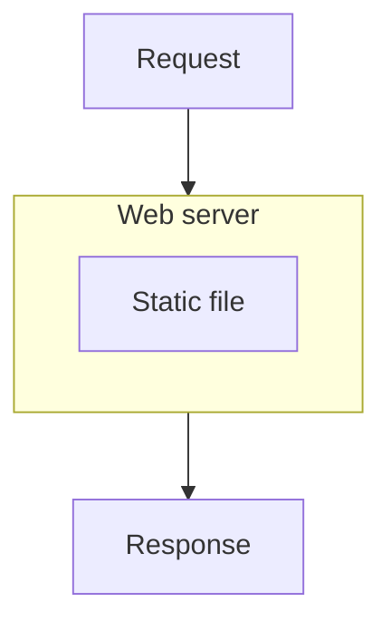
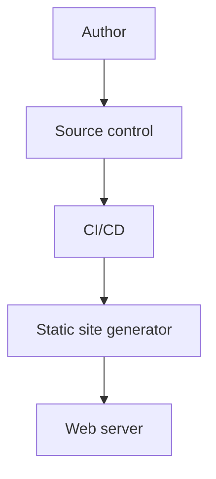
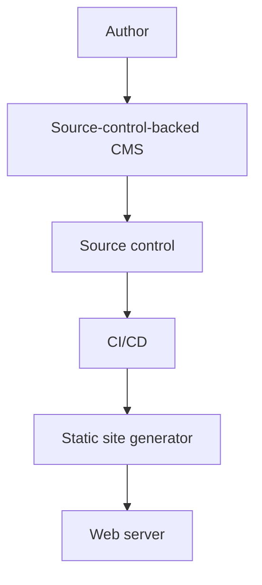

A **Content Management System** (CMS) is a software application that allows users to create and manage content for websites. Popular CMS like Drupal or WordPress are web applications that perform several steps whenever a visitor to a website requests a page. They interpret the visitor's request, look up the content for that page in a database, figure out how that content should be displayed, and then assemble the page and send it to the visitor's browser. Typically the same web application provides an admin area for authors and editors to create and manage content.

> In a traditional CMS, each page is assembled at the point it is requested. While a real system might involve caching, all of the mechanisms for editing, storing, and rendering content live on the web server and are backed by a database.

**Static Site Generators** (SSGs) such as Jekyll or Hugo have become a popular alternative. Rather than assembling each page when a visitor requests it, an SSG assembles the entire website ahead of time, producing a set of static files. When a visitor requests a page, the corresponding file is sent to the visitor's browser. When the underlying content changes, the SSG produces an updated set of files.

> In a static site, pages are pre-built and served as static files.

It's *dramatically* simpler to host the user part of an SSG-generated website. There's no database, there's no application runtime, no web application, only *files*. In order to make changes to the website, you need somewhere for the underlying data to live (since there's no database attached to your web application), you need a way to edit that data (since there's no web application) and you need somewhere for the SSG to run when that data changes (since the website is built entirely before it is deployed).

For evaluation, personal projects, or websites that aren't changed very often, or by very many people, the underlying data can be stored as files on your computer. These files are often in formats like **Markdown** or **YAML** which can be read by humans as well as computers, and so can be edited using any text editor - often an Integrated Development Environment such as Visual Studio Code, but also simple text editors like Notepad. When the files are changed, the SSG can be run again on the same computer to update the website.

## Using source control

For projects with frequent changes, multiple authors, or especially any editing workflow, it isn't practical to have your data living on a single computer, or even a network drive.

**Source control** systems such as Git are tools that allow multiple people to collaborate on the same set of files, manage different versions of the files, and track changes over time. They are typically used by software development teams to manage source code for programs, but they are also tremendously useful for managing any text-based content - such as the files underlying an SSG-generated website.

Many source control systems are attached to platforms that provide additional tools that are useful for managing content from proposal through to publication. They can track tasks, let editors review and approve changes, and provide automated workflows called **Continuous Integration/Continuous Deployment** (CI/CD) pipelines that can run the SSG and publish the latest version of the website whenever the content changes.

> Changes made to source control are automatically picked up by the CI/CD pipeline and deployed.

## Source-control-backed CMS

Using a source control system works best when everyone who needs to make changes to the website is already familiar with source control tools. While we can usually rely on this being the case for teams of software developers, it is unlikely to be true for teams of authors, editors, translators, and so on.

A **Source-control-backed CMS** such as Decap (previously Netlify CMS) or Sveltia provides a familiar interface like the admin area of traditional CMS, while still storing the underlying content in a source control system. These tools run in your web browser and integrate with the source control system in the background.

> Adding a source-control-backed CMS allows non-technical contributors to make changes via a familiar user interface.

## Resilience and disaster recovery

Because the content is stored in a source control system, your data is stored separately to your web hosting, and every change is tracked. This provides a clear history of who changed what and when, makes it easy to revert to previous versions of the website, and makes disaster recovery much simpler.

Because the public website consists of prepared files rather than a database and a running web application, it has a much smaller attack surface. There is no server-side code or database involved in serving ordinary pages, and so far fewer components are available for an attacker to target. This greatly reduces the number of potential vulnerabilities and security updates that need to be managed.

Source control systems are much more straightforward to back up than databases and web servers. Restoring the website from a backup is typically as simple as retrieving the backup and running the SSG. This can dramatically improve recovery times and reduce the risk of data loss. The RPO is typically zero - changes are captured as soon as they are committed to the source control system - and the RTO is typically very short - the time it takes to run the SSG and redeploy the website, often a few seconds. This makes source-control-backed CMS a highly resilient solution for managing website content.

## Beyond websites

The same model can be applied to other kinds of content. Any data that can be represented as text, reviewed through a change management process, and turned into usable output by automation can benefit from the same approach. I have been exploring practical applications of this model in areas like governance, quality, and compliance.
